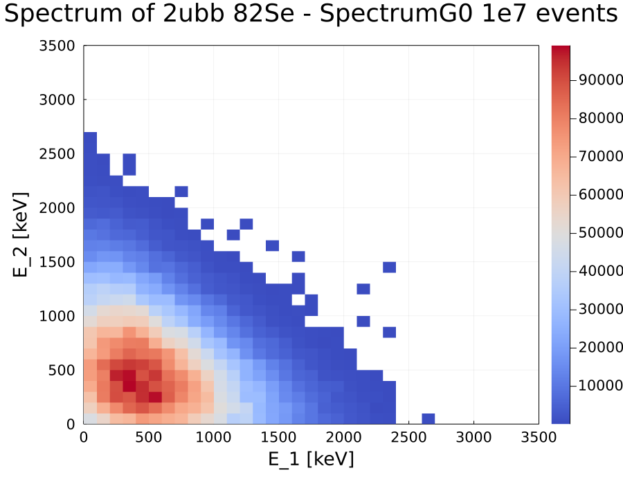
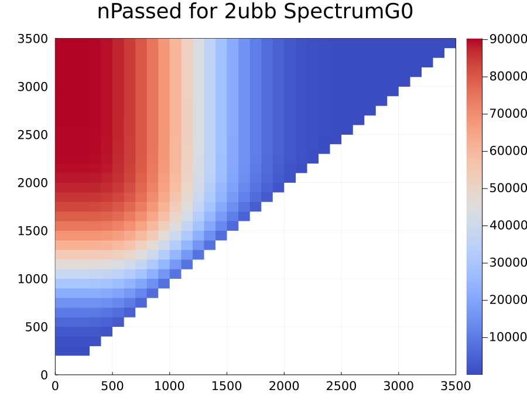
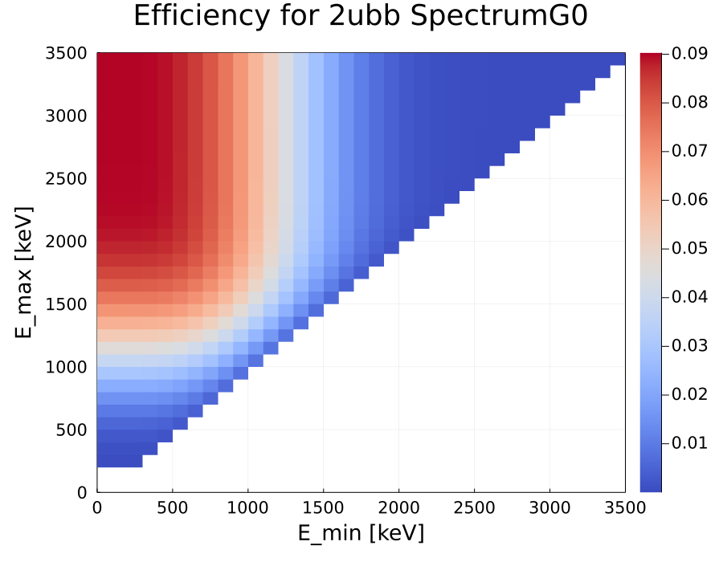
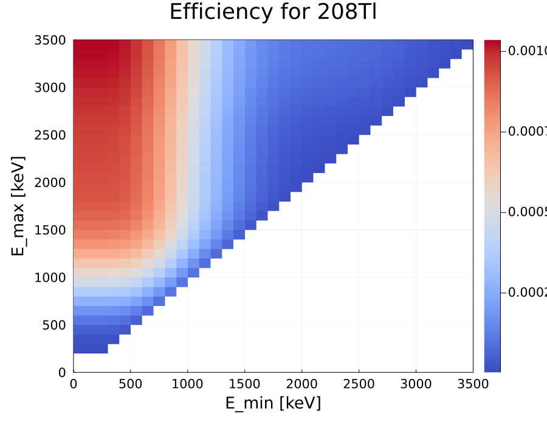
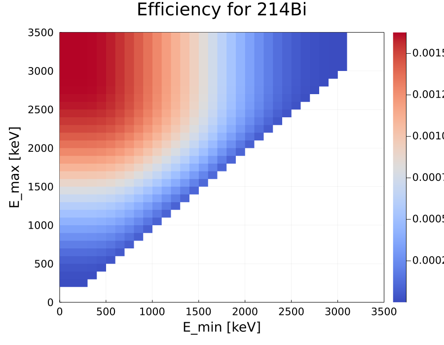
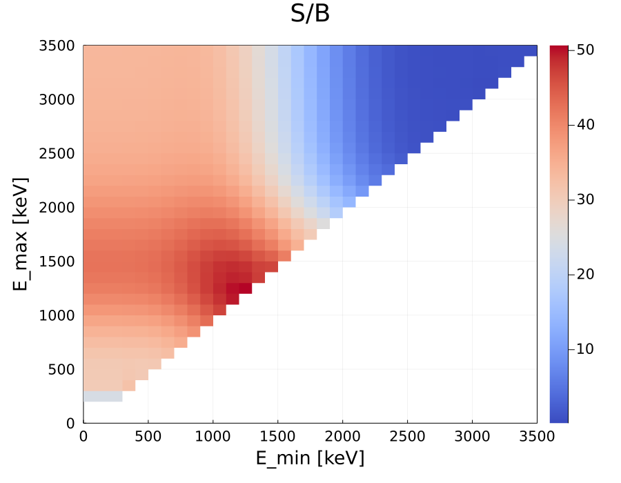

# In this example, sensitivity for $2\nu\beta\beta$ decay of Se-82 has been calculated. The data has been generated via Falaise library, 1e7 signal ($2\nu\beta\beta$) and 1e7 background (Tl-208, Bi-214) events were generated. 

### First we visualize the spectrum generated via MPgenbb of 82Se 2ubb - from SpectrumG0.


```julia
using   Plots, MPSensitivity, UnROOT, DataFrames, 
        FHist, DataFramesMeta, Distributions, 
        StatsPlots, Markdown, LaTeXStrings, PrettyTables
gr()
```


    Plots.GRBackend()


```julia
theme(  :default, 
        c = :coolwarm, framestyle = :box, 
        margin = 6Plots.mm, 
        guidefontsize = 18, tickfontsize = 14, titlefontsize = 24,
        dpi = 400, size = (900,700))
```


```julia
inFileSpectrum = ROOTFile("82Se_Spectrum_h2d.root")
```


    ROOTFile with 1 entry and 15 streamers.
    82Se_Spectrum_h2d.root
    └─ h2 (TH2F)


```julia
df = DataFrame(Emin = Float64[], Emax = Float64[])
for emin in 0:100:3400
    for emax in 0:100:3500
        push!(df, [emin, emax])
    end
end

@rtransform! df :counts = get_bin_content(inFileSpectrum, keys(inFileSpectrum)[1], :Emin, :Emax);
```

### To transform `binCounts` back to energies of individual electrons (`e1, e2`) we take the number of counts `n` in each bin and randombly sample energy within the bin `n-times`. Thus for each bin we obtain `n` sampled energies. 


```julia
e1 = Float64[]
e2 = Float64[]

for r in 1:length(df.Emin)
    for _ in 1:(df.counts[r])
        push!(e1, df.Emin[r]+rand(Uniform(0,100)))   # setting random points between the bin edges
        push!(e2, df.Emax[r]-rand(Uniform(0,100)))   # setting random points between the bin edges
    end
end
```


```julia
histogram2d(e1,e2,
            lims = (0,3500), nbins = (0:100:3500, 0:100:3500), 
            title  = "Spectrum of 2ubb 82Se - SpectrumG0 1e7 events", xlabel = "E_1 [keV]", ylabel = "E_2 [keV]"
            )
```


    

    


### To obtain sensitivity from equation:
<br>

\begin{equation}
T_{1/2} \geq ln(2)\frac{N_A}{W}a\frac{\varepsilon mt}{S(\bar{b})}
\end{equation}

<br>
Where $T_{1/2}$ - is the sensitivity in years, $N_A$ - avogadro's constant, $W$ - molecular weight ($0.08192~kg/mol$), $m$ - mass of the source foil ($7~kg$), $a$ - abundance ($0.99$ "upper limit"?), $t$ - time ($1~year$ "arbitrary"), $\varepsilon$ - is the signal detection efficiency, $\bar{b}$ - is the background count. 
<br>

#### It is now important to figure out what to input for 1.) $\varepsilon$, 2.) $\bar{b}$ and 3.) $S(\bar{b})$. 
1. $\varepsilon$ can be calculated by applying the relevant filters (from `miModule->miFilters`) and calculating for each energy $E_{min} < E < E_{max}$ the number of events that pass the filters -> $\varepsilon = \frac{N_p}{N_t}$. Segments are generated for energies from 0keV to 3500keV with stepsize of 100keV.
2. $\bar{b}$ can be calculated as $\bar{b} = \sum_iA_i\varepsilon_it$, where $\varepsilon_i$ is extracted from the ROI. To figure out what ROI to use, we find signal-to-background-ratio for each energy as $\frac{s}{b} = \frac{A_s\varepsilon_s}{\sum_iA_i\varepsilon_i}$, where i is each individual background contributor. (In this example we consider only Tl-208 as bkg.)
3. $S(\bar{b})$ is obtained using MPFC library. Chosen CL is 90%. 


## We start by obtaining $\varepsilon$ 2d histogram


```julia
const NA = 6.02214e23 # 1/mol
const W  = 0.08192    # kg/mol
const a  = 0.99       # enriched source foil
const m  = 7.0        # kg
const t  = 1.0        # year

const nSimulatedEvents = 1e7 
```


    1.0e7


```julia
inPathSignal     = "82Se_nPassed_h2d.root" 
# inPathSignal     = "82Se_2ubb_nPassed-fromFalaise.root" 
inPathBackgroundTl = "208Tl_nPassed_h2d.root"
inPathBackgroundBi = "214Bi_nPassed_h2d.root"
```


    "214Bi_nPassed_h2d.root"


```julia
inFileSignal     = ROOTFile(inPathSignal)
inFileBackgroundTl = ROOTFile(inPathBackgroundTl)
inFileBackgroundBi = ROOTFile(inPathBackgroundBi)
```


    ROOTFile with 1 entry and 15 streamers.
    214Bi_nPassed_h2d.root
    └─ h2 (TH2F)


```julia
dfEff = DataFrame(Emin = Float64[], Emax = Float64[])
for emin in 0:100:3400
    for emax in emin+100:100:3500
        push!(dfEff, [emin, emax])
    end
end

@rtransform! dfEff :nPassedSignal = get_bin_content(inFileSignal, keys(inFileSignal)[1], :Emin, :Emax)
@rtransform! dfEff :signalEfficiency = :nPassedSignal ./ nSimulatedEvents;
```


```julia
sPassed1 = Float64[]
sPassed2 = Float64[]

for r in 1:length(dfEff.Emin)
    for _ in 1:(dfEff.nPassedSignal[r])
        push!(sPassed1, dfEff.Emin[r]+rand(Uniform(0,100)))   # setting random points between the bin edges
        push!(sPassed2, dfEff.Emax[r]-rand(Uniform(0,100)))   # setting random points between the bin edges
    end
end
```


```julia
histogram2d(sPassed1, sPassed2, lims = (0,3500), nbins = (0:100:3500, 0:100:3500),
            title = "nPassed for 2ubb SpectrumG0")
```


    

    


```julia
MP_heatmap(dfEff.Emin, dfEff.Emax, dfEff.signalEfficiency,lims = (0,3500),
            title = "Efficiency for 2ubb SpectrumG0", xlabel = "E_min [keV]",
            ylabel = "E_max [keV]")
```


    

    


### To obtain best ROI, we need to look at the ratio of signal-to-background given by:
<br>
\begin{equation}\frac{s}{b} = \frac{A_s\varepsilon_s}{\sum_iA_i\varepsilon_i}\end{equation}
<br>
We assume an arbitrary activity of 1Bq.


```julia
@rtransform! dfEff :nPassedBkgTl = get_bin_content(inFileBackgroundTl, keys(inFileBackgroundTl)[1], :Emin, :Emax)
@rtransform! dfEff :bkgEfficiencyTl = :nPassedBkgTl ./ nSimulatedEvents;

@rtransform! dfEff :nPassedBkgBi = get_bin_content(inFileBackgroundBi, keys(inFileBackgroundBi)[1], :Emin, :Emax)
@rtransform! dfEff :bkgEfficiencyBi = :nPassedBkgBi ./ nSimulatedEvents;
```


```julia
MP_heatmap(dfEff.Emin, dfEff.Emax, dfEff.bkgEfficiencyTl,lims = (0,3500),
            title = "Efficiency for 208Tl", xlabel = "E_min [keV]",
            ylabel = "E_max [keV]")
```


    

    


```julia
MP_heatmap(dfEff.Emin, dfEff.Emax, dfEff.bkgEfficiencyBi,lims = (0,3500),
            title = "Efficiency for 214Bi", xlabel = "E_min [keV]",
            ylabel = "E_max [keV]")
```


    

    


```julia
@rtransform! dfEff :sb = get_SB_ratio( (1., :signalEfficiency), (1., :bkgEfficiencyTl), (1., :bkgEfficiencyBi) );
```


```julia
MP_heatmap(dfEff.Emin, dfEff.Emax, dfEff.sb,lims = (0,3500),
            title = "S/B", xlabel = "E_min [keV]",
            ylabel = "E_max [keV]")
```


    

    


```julia
header = (["Emin ", "Emax ", "nPSignal", 
            "εSignal ", "nPTl", "εTl", "nPBi", "εBi", "s/b"
          ],
          ["[keV]", "[keV]", "[#]", " ", "[#]",
            " ", "[#]", " ", " "
          ])

data = DataFrame(dfEff[argmax(dfEff.sb),:])
pretty_table(data; header = header)
```

    ┌────────┬────────┬──────────┬───────────┬───────┬─────────┬───────┬─────────┬─────────┐
    │  Emin  │  Emax  │ nPSignal │  εSignal  │  nPTl │     εTl │  nPBi │     εBi │     s/b │
    │  [keV] │  [keV] │      [#] │           │   [#] │         │   [#] │         │         │
    ├────────┼────────┼──────────┼───────────┼───────┼─────────┼───────┼─────────┼─────────┤
    │ 1200.0 │ 1300.0 │  81968.0 │ 0.0081968 │ 761.0 │ 7.61e-5 │ 856.0 │ 8.56e-5 │ 50.6914 │
    └────────┴────────┴──────────┴───────────┴───────┴─────────┴───────┴─────────┴─────────┘


<hr>

### ROI with best S/B is found to be $E \in (1200,1300)keV$

With $CL = 90\%$ FC sensitivity for $\bar{b} \geq 329$ can be approximated by $\approx 1.8\sqrt{\bar{b}}$ 
<hr>


```julia
ε = dfEff[argmax(dfEff.sb), :signalEfficiency]
bTl = dfEff[argmax(dfEff.sb), :bkgEfficiencyTl]*1.0*31536000.0 # 31536000s in one year
bBi = dfEff[argmax(dfEff.sb), :bkgEfficiencyBi]*1.0*31536000.0 # 31536000s in one year
b = bTl + bBi

FCb = 1.8*sqrt(b)
T12 = log(2)*NA*a*m*t/W/FCb*ε
```


    2.2518171353934657e21


# Thus calculated Sensitivity at 90% CL, with 1kgy exposure for Se-82 with spectrum generated from SpectrumG0 file from R. Dvornicky is:
\begin{equation}
T_{1/2} \geq 2.25\cdot10^{21} yr.
\end{equation}
